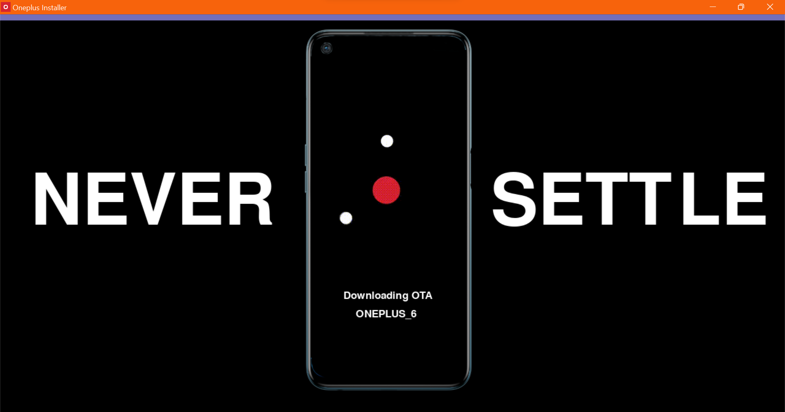
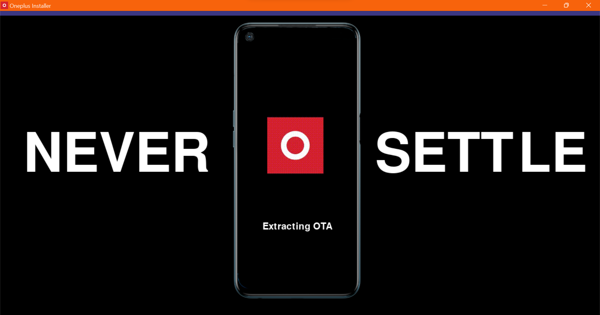
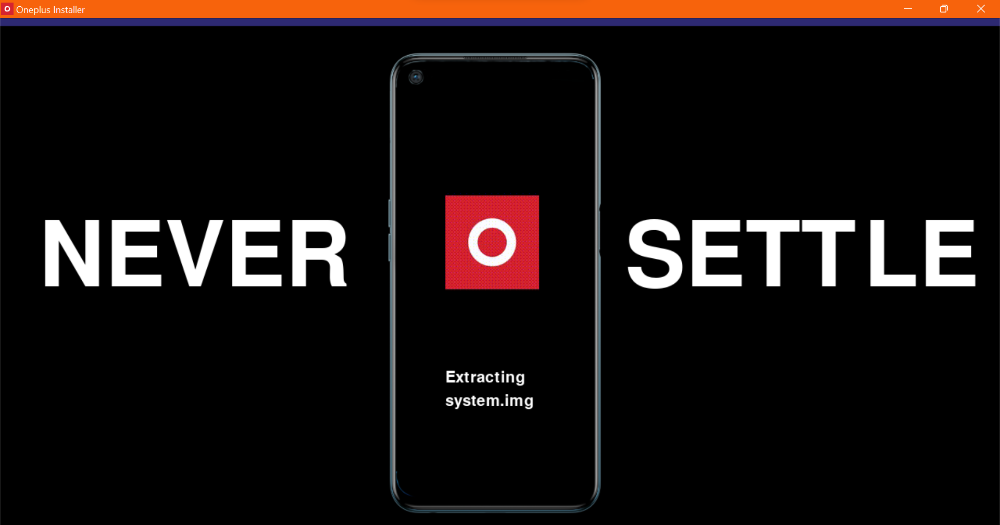

  <br/>
Windows Desktop GUI for installing OTA Updates from fastboot on Oneplus Devices


 
<br/>

# Screens






<br/>

# System Requirements
• Windows Computer
• (opt) Python3

# Features
• Desktop GUI for installing OTA updates in OnePlus Devices<br/>
• No Python Required! Just install and run it<br/>
• 3-In-1 Application (Download, Extract and Install OTA)<br/>

# Installation

``` Microsoft Windows```
```
git clone https://github.com/daviiid99/Oneplus_Installer .git Oneplus_Installer 
cd Oneplus_Installer 
python main.py
```